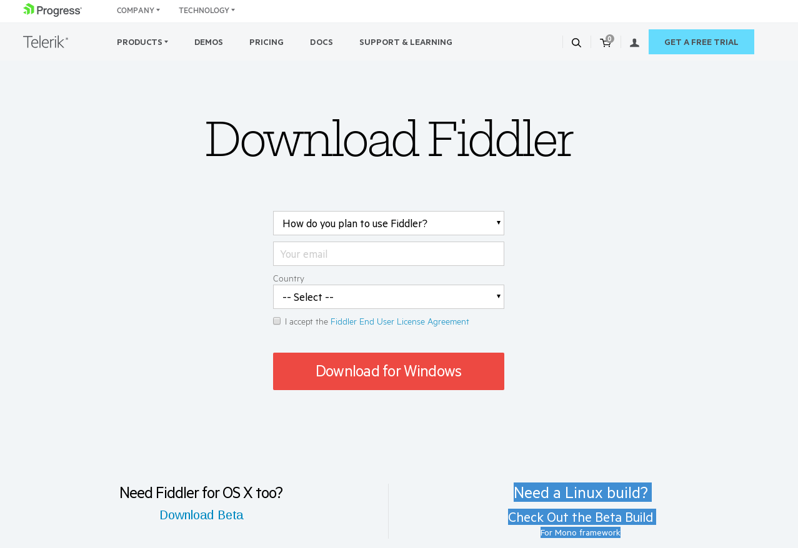
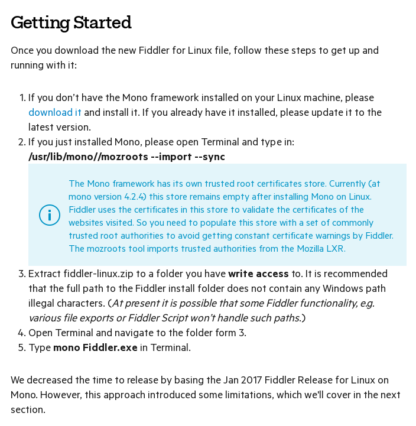
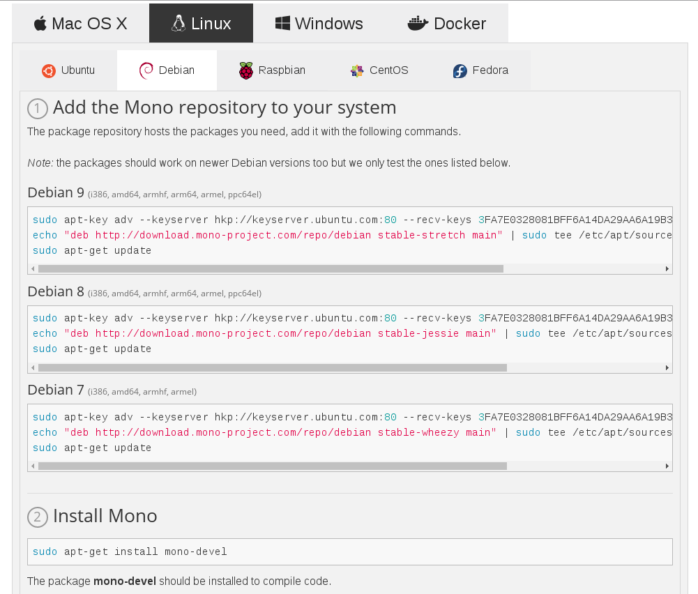
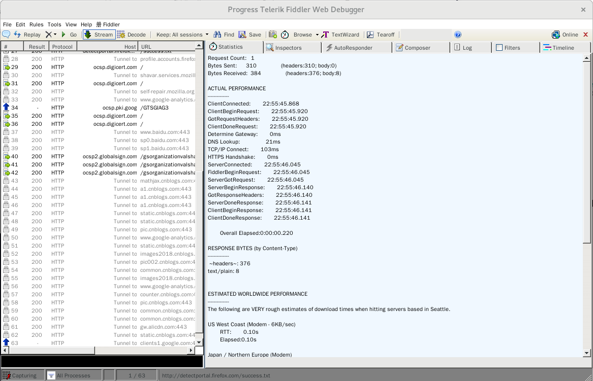

> 打算开始爬网易云音乐的评论，看了看网上的教程，准备一步一步自己来实现。过程中需要用到Fiddler，但是Fiddler对Linux支持不是很好，安装过程可能会比较复杂。为了记录下来整个过程以免自己忘记，于是就有了这篇文章。

<!--more-->

## Fiddler简介

Fiddler是最强大最好用的Web调试工具之一，它能记录所有客户端和服务器的http和https请求，允许你监视，设置断点，甚至修改输入输出数据。Fiddler是用``C#``写出来的，它包含一个简单却功能强大的基于JScript .NET事件脚本子系统，它的灵活性非常棒，可以支持众多的http调试任务，并且能够使用.net框架语言进行扩展。

你对HTTP协议越了解，你就能越掌握Fiddler的使用方法。你越使用Fiddler，就越能帮助你了解HTTP协议。
Fiddler无论对开发人员或者测试人员来说，都是非常有用的工具。

## Fiddler安装

第一步肯定是上官网看看有没有直接的安装包，找到了，还很隐秘：



看到右下角，小小的角落里面藏着Linux版本的程序包。

又在官网转了转，又找到了安装说明——[Fiddler在Linux安装的说明](https://www.telerik.com/blogs/fiddler-for-linux-beta-is-here/ "Fiddler Linux安装说明")：



如图所示，Fiddler提醒我们第一步应该先安装Mono，Mono又是个什么呢？

### Mono简介

Mono是.NET Framework 的一种开源实现。Mono项目使开发者用各种语言（C＃,VB.NET等）开发的.NET应用程序，能在任何Mono支持的平台上运行, 包括Linux, Unix。Mono项目将使大家能开发出各种``跨平台``的应用程序, 并能极大提高开源领域的开发效率。作为一个有机的.NET整体, 它包括一个C#编译器, 一个公用语言运行时环境, 以及相关的一整套类库，他甚至还包括IDE、调试工具和文档浏览器。

Mono项目的网址是：[Mono项目官网](http://www.mono-project.com/ "Mono项目官网")，想深入了解的可以到官网详细了解一下。

### Mono安装

同样，进入官网查看是否有安装帮助。果然，一下子就找到了：



可以看到Mono的安装说明更加简单粗暴，直接上命令，我也不多BB，马上开干：

根据我的操作系统类型及版本（Debian 9）来确定合适的命令：

```Shell
sudo apt-key adv --keyserver hkp://keyserver.ubuntu.com:80 --recv-keys 3FA7E0328081BFF6A14DA29AA6A19B38D3D831EF
echo "deb http://download.mono-project.com/repo/debian stable-stretch main" | sudo tee /etc/apt/sources.list.d/mono-official-stable.list
sudo apt-get update
sudo apt-get install mono-devel
```

简单解释一下四句话都是什么意思：

- 第一句：下载公钥。如果不下载公钥，下一步执行会报“不安全”的错误

- 第二句：在/etc/apt/sources.list中添加Mono的源

- 第三句：重新加载本地包数据库

- 第四句：安装Mono软件

但是我在自己机器上安装运行第一句的时候就出错了...

#### Mono安装出错

出错信息大概这样：

```Shell
titus@Titus:~$ gpg --recv-keys 9AA9BDB11BB1B99A21285A330664A76954265E8C
gpg: failed to start the dirmngr '/usr/bin/dirmngr': No such file or directory
gpg: connecting dirmngr at '/run/user/1000/gnupg/S.dirmngr' failed: No such file or directory
gpg: keyserver receive failed: No dirmngr
```

我刚开始以为是因为没有``/usr/bin/dirmngr/``文件夹，于是我

```Shell
mkdir /usr/bin/dirmngr/
```

重新运行，第一个错误确实不报了，但是第二条错误仍然存在。没办法了，只能网上看看大家是怎么处理的，一开始没看到什么相同的情况，但是看到这篇文章[“OpenPGP smartcard under GNOME on Debian 9.0 Stretch”](https://blog.josefsson.org/2017/06/19/openpgp-smartcard-under-gnome-on-debian-9-0-stretch/ "OpenPGP smartcard under GNOME on Debian 9.0 Stretch")。虽然没怎么看懂这哥们儿咋了，但是发现他的文章里有这么一句：

> Surprisingly, dirmngr is also not shipped by default so it has to be installed manually.
> > root@latte:~# apt-get install dirmngr

我这才发现，原来``dirmngr``是一个软件，而且不是默认安装的，汗！

安装好dirmngr之后，重新按照上述步骤一步步地安装好了Mono。

## 继续安装Fiddler

按照说明，先配置Mono：

```Shell
/usr/lib/mono/mozroots --import --sync
```

接下来就是解压下载来的``fiddler-linux.zip``，注意要解压到当前账户有写入权限的目录下，我是直接解压到Home下。
这里就可以发现，我们下载来的程序包其实类似于绿色版的Fiddler，免安装。

## 大功告成

按照惯例，这一节是大功告成～

打开终端``cd``到解压的目录下，执行：

```Shell
mono Fiddler.exe
```

到现在为止，Fiddler就配置好可以使用了。



P.S. 好像MongoDB安装也是类似安装Mono的过程，过两天装上玩玩。
