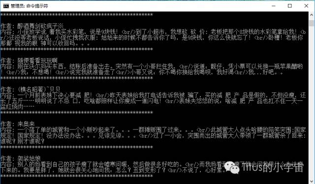
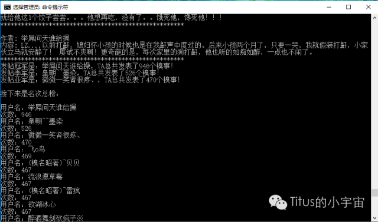
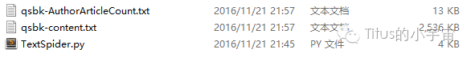

> 新开博客，为了撑撑场面，把我公众号里面为数不多的几篇文章搬过来。

### 缘由

看到网上人家写的爬虫能够自动爬取一些信息，顿时觉得很NB，于是萌生学习Python的想法。<!--more-->
前段时间开始接触Python，Python目前分为两个大版本：Python2和Python3。Python2用的最多的是Python2.7.?，Python3用的最多的是Python3.5.，当然这两者都在不断的更新，但是据说Python2到2020年就要停止Support了。不了解的人可能不知道，以为就跟VS2010和VS2015一样，基本上可以通用，其实不然，Python3与Python2其实有着比较大的不同——不管是语法，特性还是第三方包都是不能通用的。
综合考虑之后觉得，既然Python3能够出现，它就是有意义的，就算现在支持的第三方包没有Python2的多，但相信随着时间的推移，越来越多的第三方包会走进Python3的怀抱，故我选择了学习Python3。所以以后有关于Python的文章都会是基于Python3的。

### 文本类爬虫

说了这么多，现在开始切入正题。那么什么叫文本类爬虫呢？我的理解就是专门爬取网页上的文字信息的爬虫。说到这个很容易想到拿糗事百科网站练手，爬取网站上的段子。
道理其实很简单，就是用Python自带的包下载网页数据，再利用正则表达式选取所需要的内容就可以。当然，道理是这个道理，中间还是需要注意请求网页的技巧以及关于字符集的处理等，这些我也还不是很熟练，这里就略过不讲，争取专门写一篇来讲这些。
首先我们要用到urllib包和re包，前者是用来下载网页数据的，后者则提供正则表达式的支持。urllib包在Python2中是叫做urllib2，用法也与在Python3中的很不同，所以这里也体现出了Python版本不同造成的影响，所以切记本文是用Python3开发的。

```Python
#-*- coding=utf-8 -*-
import re
import urllib
import urllib.request
```

现在开始构建HTTP请求头：

```Python
conn = 'Keep-Alive'
acce = 'text/html, application/xhtml+xml, */*'
lang = 'en-US,en;q=0.8,zh-Hans-CN;q=0.5,zh-Hans;q=0.3'
user_agent = 'Mozilla/4.0 (compatible; MSIE 5.5; Windows NT)'
headers = {'Connection': conn, 'Accept' : acce, 'Accept-Language' : lang, 'User-Agent' : user_agent}
```

下面就到了最关键的代码：

```Python
try:
    request = urllib.request.Request(url, headers = headers)
    response = urllib.request.urlopen(request, timeout = 2)
    htmlData = response.read().decode('utf-8')
except urllib.error.URLError as e:
    if hasattr(e,'code'):
        print(e.code)    
    if hasattr(e, 'reason'):
        print(e.reason)    
    continue
```

可以看到，关键部分其实不多，就这么三行代码而已，但是所有的信息都是从这里来的。其中timeout表示设置超时时间以免程序一直停在这里，htmlData为读取的网页数据，读取数据之后需要将其解码，一般的网页都是UTF-8编码，但有的网页不是，这里需要注意。
下面就是用正则表达式处理得到的信息了：

```Python
try:
    pAuthorContent = re.compile(r'<div.*?class="article .*?<h2>(.*?)</h2>.*?<span>(.*?)</span>', re.S) 
    items = re.findall(pAuthorContent, htmlData)

    for item in items:
        txt = '\n作者: ' + item[0] + '\n' + '内容: ' + item[1] + '\n'
        print(txt)    
        if item[0] not in dicAuthorArticleCount:    
            dicAuthorArticleCount[item[0]] = 1    
        else:    
            dicAuthorArticleCount[item[0]] += 1    
        fContent.write(txt)    
except:
    continue
```

可以看到我是将段子作者和内容一起提取出来了，最后还将其写入了一个本地的txt文件中。另外，做了一个统计功能：统计再爬取的所有页面中将所有发帖人按照发帖次数排序，授予他们冠军亚军季军称号。

### 成果展示

下面是截图：







看得出来，喜欢“搞事”的就那么几个。。。

--------

下期预告：[用Python爬取网页上的图片](https://tituswong521.github.io/2016/11/30/%E5%88%A9%E7%94%A8Python%E7%88%AC%E5%8F%96%E7%BD%91%E9%A1%B5%E5%9B%BE%E7%89%87/)
