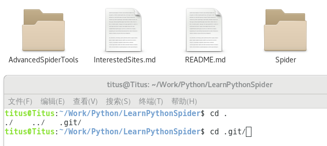
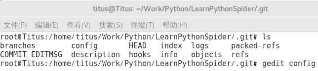
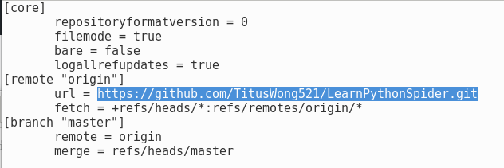

> 在本地写了一些代码之后想要push到github上，结果发现这个错误：
> ** Could not read from remote repository. **

<!--more-->

### 问题背景

本地码了一段时间代码，按常规就准备上传了，结果终端给我提示：
> fatal: Could not read from remote repository.
> 致命:无法读取远程存储库。
> Please make sure you have the correct access rights and the repository exists.
> 请确保你有正确的访问权限和存储库的存在。 

### 问题分析

由于我机器上有好几个仓库，于是我之前生成了好几个sshkey，但是都是存储在``~/.ssh/id_rsa.pub``文件内，每次新建一个就会把前一个覆盖掉。

于是我每生成一个sshkey的时候，我都会重新起一个对应的名字。

### 问题解决

根据以上分析，可能的原因就是设置了SSH方式连接，在没有ssh证书的情况下是连接失败的。
要想一劳永逸，解决方法是把ssh连接，修改为https方式连接。

- 复制https连接

- 找到本地git仓库的配置文件

由于在Linux系统下，以``.``开头的文件夹会默认隐藏，所以不能直接显示，按照下图操作即可。

- 编辑配置文件

- 用gedit来打开密钥文件的，可以看到``url``一栏

- 后面是git连接，将刚才复制的https连接粘贴进来

- 保存之后重试

这样修改以后，每次提交会要求输入github的帐号和密码，但是是可以成功提交的。

