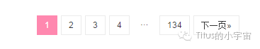
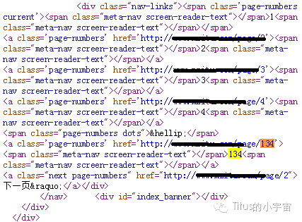
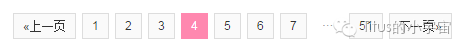
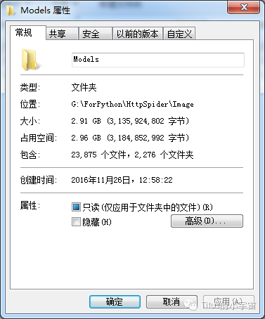

> 新开博客，为了撑撑场面，把我公众号里面为数不多的几篇文章搬过来。

--------

> 上次说了关于爬取糗事百科段子以及统计发帖次数的爬虫，其实那个是爬虫最简单的运用。今天我们来看看如何利用Python爬虫来爬取网页上面的图片并将其按目录保存在本地文件系统，文章仅用于技术交流，请不要做坏事。
<!--more-->

### 缘由

距离上次的文章已经过了好一段时间了，中间我又学习了一些新的可以用于写爬虫的库，真的是相当方便。但是考虑到学习得一步步的来，所以这次还是介绍最基础的那几个库，因为只有学会使用最基础的库来完成整个爬虫的代码才能对整个流程有一个自己的把握。

当时在写爬图像的爬虫之前，在网上有搜索一些相关资料，发现好多哥们儿都是拿这个网站——http://www.m****.com 开刀（为了避免被查水表，我就不详细写出来了，想知道的哥们儿肯定有办法知道-.-||），于是我也记下了这个网站。。为了便于后面讲解，这里简单介绍一下这个网站。这个网站是一个专门的图片站，里面有很多个模特的写真集，而每个模特又都有一系列的写真照，所以这里面会涉及到一个翻页的问题。好了，废话少说，下面开始正题。

### 进入正题

由于模特数量众多，而网站又没有使用动态加载的方式，所以在一个页面要显示出所有的模特肯定是不可能的或者是不好的。经过统计，每一页有3*8=24个模特，将页面拉到最下面，可以看到总页码是134，观察URL可以发现，每一页的URL除了页码部分都是一样的，这说明我们可以通过一个固定的BaseUrl和页码组合成我们需要的网址信息。





当然，我们眼睛观察很简单，如何让程序知道有多少页呢？我们在页面点击鼠标右键来查看页面源代码，看看能不能在源代码里面找到，经过定位后发现，果然在源代码里面有这么一段：

```HTML
<nav class="navigation pagination" role="navigation">
  <h2 class="screen-reader-text">Posts navigation</h2>
  <div class="nav-links"><span class='page-numbers current'><span class="meta-nav screen-reader-text"></span>1<span class="meta-nav screen-reader-text"></span></span>
  <a class='page-numbers' href='http://www.m****.com/page/2'><span class="meta-nav screen-reader-text"></span>2<span class="meta-nav screen-reader-text"></span></a>
  <a class='page-numbers' href='http://www.m****.com/page/3'><span class="meta-nav screen-reader-text"></span>3<span class="meta-nav screen-reader-text"></span></a>
  <a class='page-numbers' href='http://www.m****.com/page/4'><span class="meta-nav screen-reader-text"></span>4<span class="meta-nav screen-reader-text"></span></a>
  <span class="page-numbers dots">&hellip;</span>
  <a class='page-numbers' href='http://www.m****.com/page/134'><span class="meta-nav screen-reader-text"></span>134<span class="meta-nav screen-reader-text"></span></a>
  <a class="next page-numbers" href="http://www.m****.com/page/2">下一页&raquo;</a></div>00</nav>
```

这样我们就可以用之前说过的匹配字符的正则表达式把这个页码匹配出来，代码以一个函数的形式列举出来，里面包含一些自定义的日志以及异常记录。如下：

```Python
#获取url对应的网页内容
def getPage(self, url):
    self.errorInfo += 'Program run in Spider.getPage()\n'
    self.programStatus += '正在抓取[' + url + ']的网页内容...\n'
    print('正在抓取[' + url + ']的网页内容...')    
    try:
        print(r'response = urllib.request.urlopen(url, timeout = 30)')
        response = urllib.request.urlopen(url, timeout = 30)
        print("htmlData = response.read().decode('utf-8')")
        htmlData = response.read().decode('utf-8')        
        return htmlData    
    except Exception as e:
        self.errorInfo += '[ErrorInfo]-[getPage]-[url]:' + url + '\n'
        return ''

#获取首页的页数
def getPageCount(self, url):
    self.errorInfo += 'Program run in Spider.getPageCount()\n'
    self.programStatus += '正在通过[' + url +']获取页面总数量...\n'
    print('正在通过[' + url +']获取页面总数量...')
    returnValue = ''
    try:
        reStr = '</span>([0-9]{1,4})<span class="meta-nav screen-reader-text"></span></a>.<a class="next page-numbers"'
        htmlData = self.getPage(url)
        pattern = re.compile(reStr, re.S)
        items = re.findall(pattern, htmlData)
        returnValue = '[items:][type]' + str(type(items)) + '[Value]:' + str(items)        
        return items[0]    
    except:
        self.errorInfo += '[ErrorInfo]-[getPageCount]-[url]:' + url + '\n'
        self.errorInfo += '[ValueInfo]-[getPageCount]-[returnValue]:' + returnValue + '\n'
        return ''
```

得到总页数是第一步，让我们知道一个具体的寻找范围。确定了寻找范围之后，我们就可以获取到所有模特的主页地址，代码里面我是使用一个list来存储这些地址的。

上面得到了所有模特的主页地址，照例我们打开一个网页进行查看。这里就不打开了，只说结论：打开之后的网页一般只有一张图片，写真集中的每一张照片分开在多个网页显示。与前面相似，这里每一张照片对应一个URL，而且每一个URL都是十分相似，只是后面会有一部分随着页码的变化而变化。那么，我们使用相同的方法获取这里的页数，具体的代码就不贴了，大同小异，只是正则表达式改一下就好。同样，根据URL的规律组合得到每一个模特对应的所有照片的地址并存储在变量中。



通过上面的操作我们得到了所有模特的主页地址，然后又通过操作获得了每一个模特的所有图片所在网页的地址，那么我们怎么才能拿到照片呢？很简单，网页上的任何一个元素都有一个URL对应它的存放位置，我们只需要将这个地址获取到就好。还是一样，通过正则表达式获取到每一个网页中照片对应的URL，根据模特来分别存储，这个URL长这样：

```HTML
http://i.m******.net/2016/11/26a04.jpg
```

下面是重头戏，也是抓取图片与抓取文本最不一样的地方，得到了照片的URL之后，同样通过getPage获取网页内容，这里不同的是因为我们要获取的图片，所以在保存的时候要采用二进制保存。

```Python
response = urllib.request.urlopen(imagePath, timeout = 30)
htmlData = response.read()
with open(path + '\\' + imageName, 'wb') as f:
    f.write(htmlData)
self.programStatus += '第[' + str(imageIndex) + ']张照片抓取完成.\n'print('第[' + str(imageIndex) + ']张照片抓取完成.')
```

看到打开文件的方式为”wb”就意味着以二进制方式写入，程序自动写入每一张照片，存放在对应的模特的文件夹内。现在你就可以静静的看着文件夹中照片一张一张的产生，然后开始打开观看吧。

### 成果展示

目前这个代码还是最初的版本，完全是单线程，从开始运行到结束总共花了接近16个小时（前一天晚上9点开始运行，到第二天下午1点），而且中间由于网络问题以及我的其他下载动作导致网速太慢超时，导致好些照片都没有下载下来。不过因为异常处理的比较好，程序一直没有停下来，这也是程序成功结束的主要原因之一。第二天查看的时候，导出的文件夹下总共有2279个文件夹，总大小为2.96G，下面是截图。


