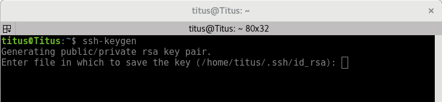
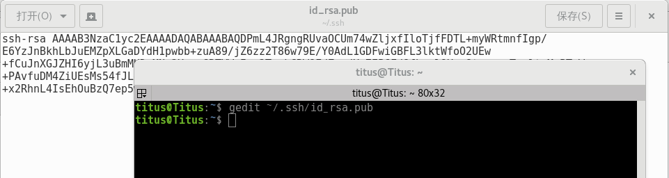
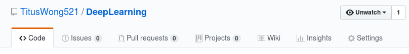
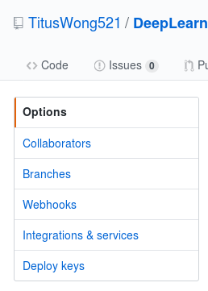
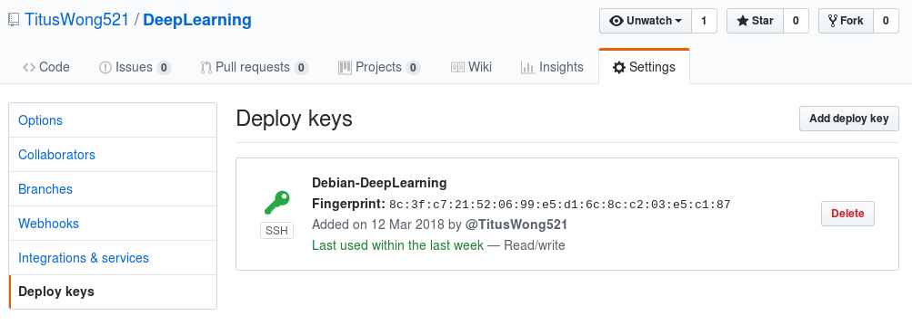
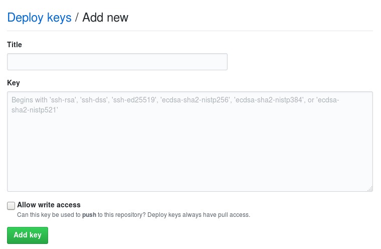
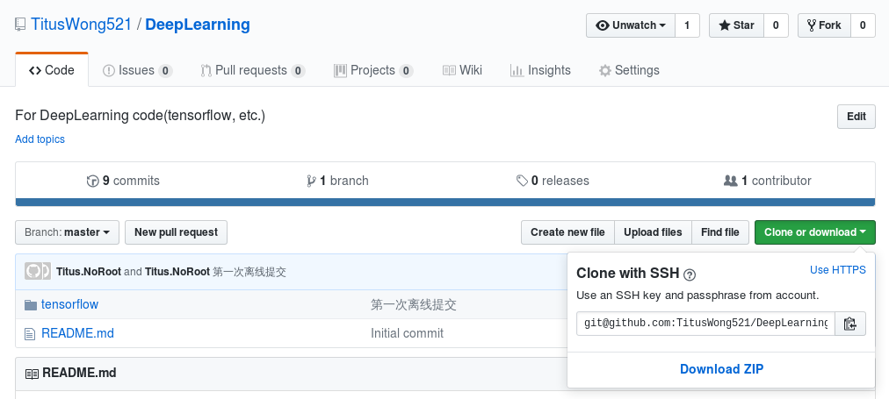
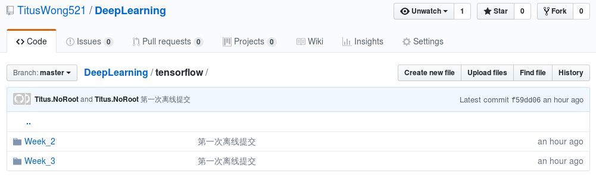

> 最近在看TensorFlow的视频，跟着视频会写一些Code，存在本地怕丢失了，于是产生存在Github的想法。刚好我本身就在Github上有一个相关的仓库，于是需要在本地进行Github代码的相关操作，这篇文章应运而生。

<!--more-->

### 运行环境

我的运行环境是Debian GNU/Linux 9 (stretch) 64 位，git 2.11.0，同时要安装好ssh，当然还需要你提前准备好一个Github账号。

### 操作步骤

怎么在Github新建一个仓库就不说了，这个基本没难度。

仓库建好以后，我们需要将我们本地机器的rsa码与这个仓库绑定，操作过程如下：

获取本地机器的rsa码

``` Python
ssh-keygen
```



一路确定下去，然后执行下面的命令读取rsa内容

``` Python
gedit ~/.ssh/id_rsa.pub
```



我是使用gedit来打开密钥文件的，这个随意，只要能获取到内容就行，复制好密钥代码备用。

进入刚建好的代码仓库，点击下图右边的“Setting”



点击最下面的“Deploy keys”



由于我已经配置好了，所以上面已经有一个在使用的key了。现在点击右边的“Add deploy key”



Title可以随便填，最好填一个有意义的（我填的是：Debian-DeepLearning），Key这一栏内填入刚才复制的rsa密钥，点击“Add key”即可。



** 补充 **

> 这里还需要把复选框勾上，才能有修改的权限。
> add on 2018/3/18

现在可以开始准备在本地配置代码仓库了，操作过程如下：

我们需要拿到仓库地址，以便clone到本地，如下图：



点击右边的按钮即可方便的复制git地址。

到本地文件系统中你想要建立仓库的地方，打开终端，进行代码克隆，如下：

``` Python
git clone git@github.com:TitusWong521/DeepLearning.git
```

进行这一步的时候不需要提前在本地新建一个与代码仓库同名的文件夹，因为在克隆时会自动新建这个文件夹。

终端进入github下载的项目工程中

``` Python
cd DeepLearning
```

依次输入以下代码即可完成其他剩余操作：

``` Python
git add .  （注：别忘记后面的.，此操作是把DeepLearning文件夹下面的文件都添加进来）
git commit -m "提交信息" (注：“提交信息”里面换成你需要的，我写的是“第一次离线提交”）
git push -u origin master （注：此操作目的是把本地仓库push到github上面，如果前面rsa key配置成功，此步骤无需帐号和密码可以直接执行成功）
```

### 大功告成！



